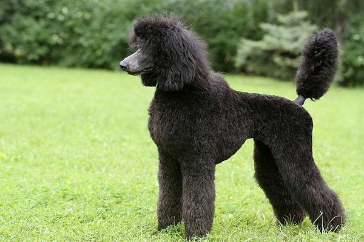
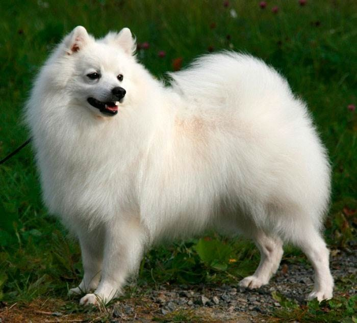

## All about poodles and volpino

# Origin. 

Opinions about the origin of this dog are controversial: it is not known whether this breed was bred in France, Germany, Denmark or Piedmont. However, it has been established that the poodle is descended from the extremely rare French water dog - the barbet.

# Description. 
There are three varieties of poodle: standard, miniature and toy poodle. The height of a standard poodle is 38 cm and above, a miniature one is at least 25.4 cm and no more than 38 cm, a toy poodle is less than 25.4 cm. Average weight: 22.12 and 7 kg, respectively. The poodle has a noble, regular, proportional head in relation to the body. In black, white, blue, silver and cream dogs, the nose should be black, and in brown and coffee poodles, it should be dark chestnut. They have a regular skull, thin cheeks, and a scissor bite. The eyes are black or brown, the look is lively. The ears hang along the cheeks and are covered with wavy hair. The neck is firm, slightly arched. The head is held up proudly. The tail is docked by half or two-thirds. Wool in curls or cords. The color is always solid, any of the above colors. These dogs must be regularly sheared “like a lion” or “like a sheep.” Other haircuts are not allowed at the shows.

# Character. 
Very good-natured, intelligent, brave, funny, sensitive, trainable.
 
# Application. 
In France, these dogs are called caniche from the word canard (duck), because they used to serve as retrievers, bringing game from the water and swamps. However, thanks to their pleasant character, beauty and intelligence, the poodles soon passed into the category of decorative dogs. They have an excellent sense of smell and are excellently oriented on the terrain. Better than other dogs, they understand human speech. The poodle tolerates bathing and grooming and loves to play with children. Dogs of this breed do not accept strict training.

# Origin. 
These dogs have the same ancestors as the Spitz. In the XVIII century. this breed was called the Florentine Spitz, and in the 19th century. - cane del chirinale.

# Description. 
These dogs are very similar to the Pomeranian. They have a slightly sturdier head, larger eyes, and have either red or white hair, while the Pomeranian can also be gray, black or orange. According to the standard, the height of a Volpino Italiano should be between 27 and 30 cm for a male and between 25 and 30 cm for a female. The weight of these dogs should not exceed 4 kg. They have a pyramidal head, a wet black nose, straight white teeth and a pronounced transition from the forehead to the muzzle. The eyes are ocher, the look is lively, intelligent. The ears are triangular, erect. The tail is about 14 cm long, covered with long hair, curled and carried over the back.

Encyclopedia of the dog. Decorative dogs. - i_003.jpg
# Character. 
Lively, cheerful, noisy, loyal to the family, suspicious of strangers.

# Application. 
They are cute decorative dogs, disease-resistant and long-lived.

